# آزمایش نهم

طبق راهنمای آزمایش، 4 AS که هرکدام شامل یک روتر است میسازیم.
برای این کار ابتدا روتر ها را روی صفحه قرار میدهیم و اتصال بین آنهارا برقرار میکنیم. سپس اینترفیس هارا آیپی داده و آنهارا روشن میکنیم.
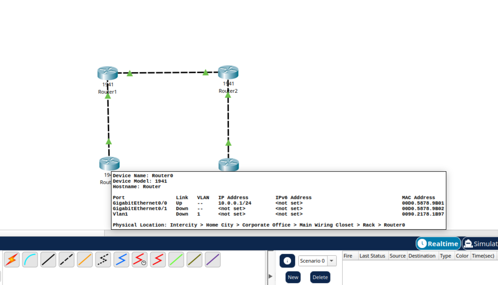
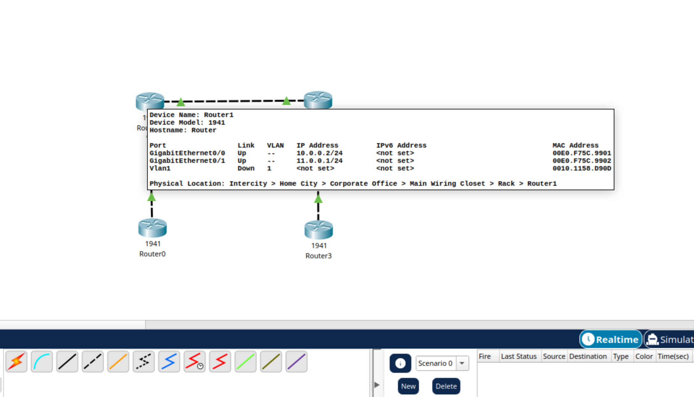
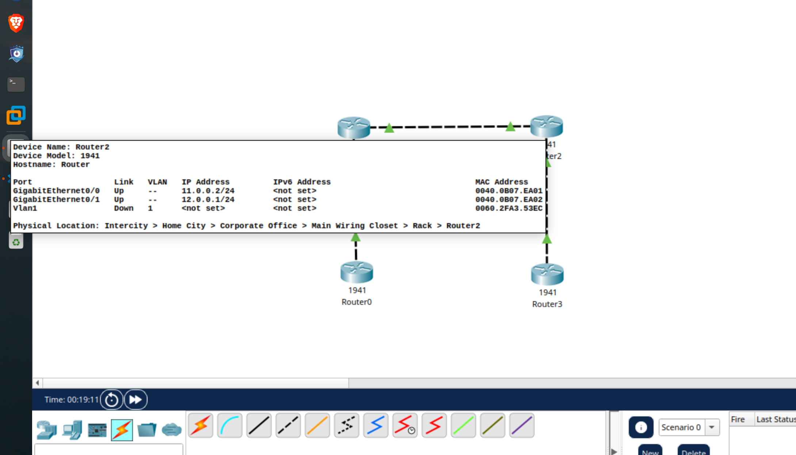
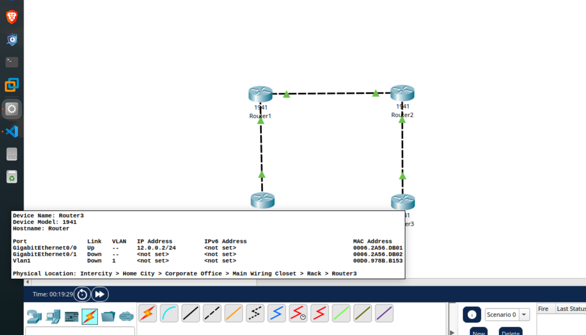
حال تنظیمات BGP را در تمام روتر های انجام میدهیم.
برای روتر 0 به شکل زیر خواهد بود.
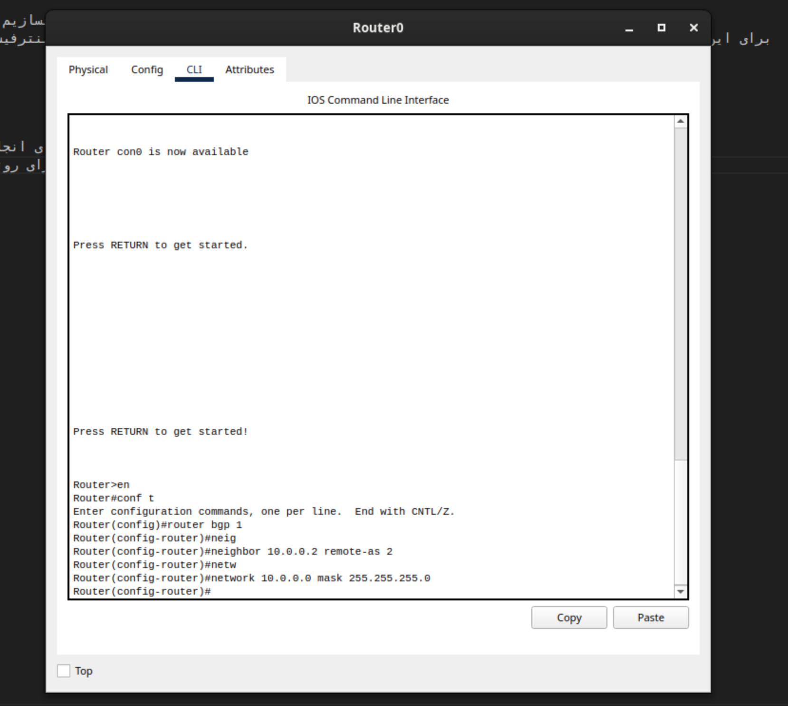

روتر 1
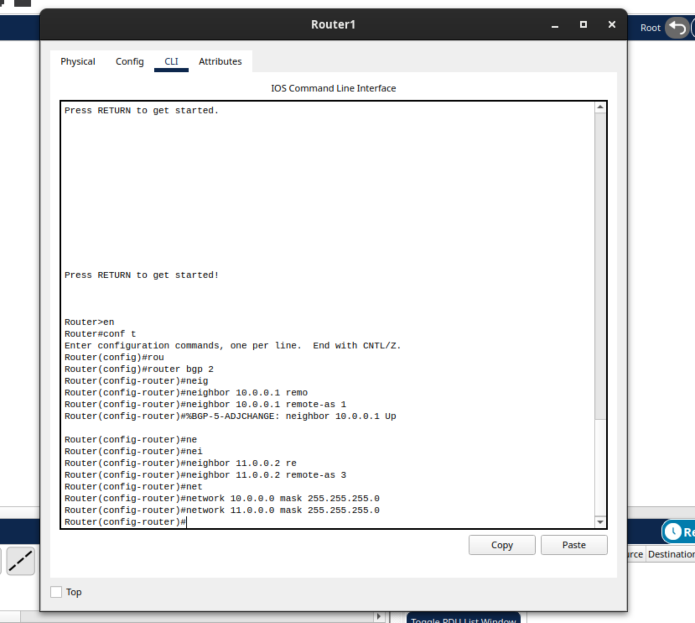

روتر 2
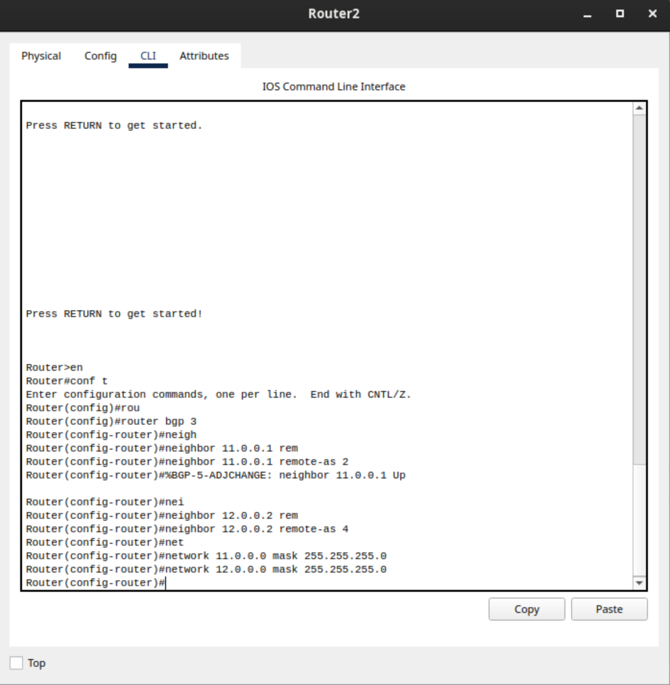

روتر 3
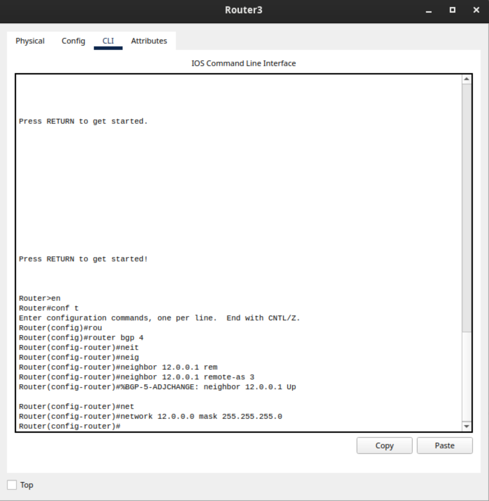

حال برای بررسی بسته های تبلیغ رد و بدل شده، روی مود سیمولیشن میرویم، و بسته ها را بررسی میکنیم. همانطور که در تصویر زیر مشاهده میشود، از پروتکل TCP استفاده شده است.
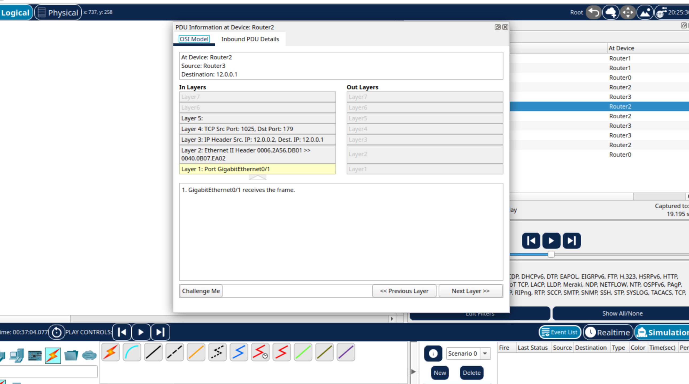
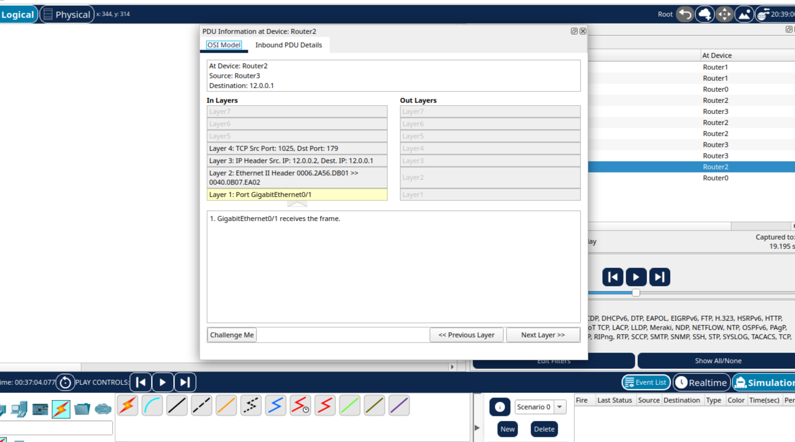
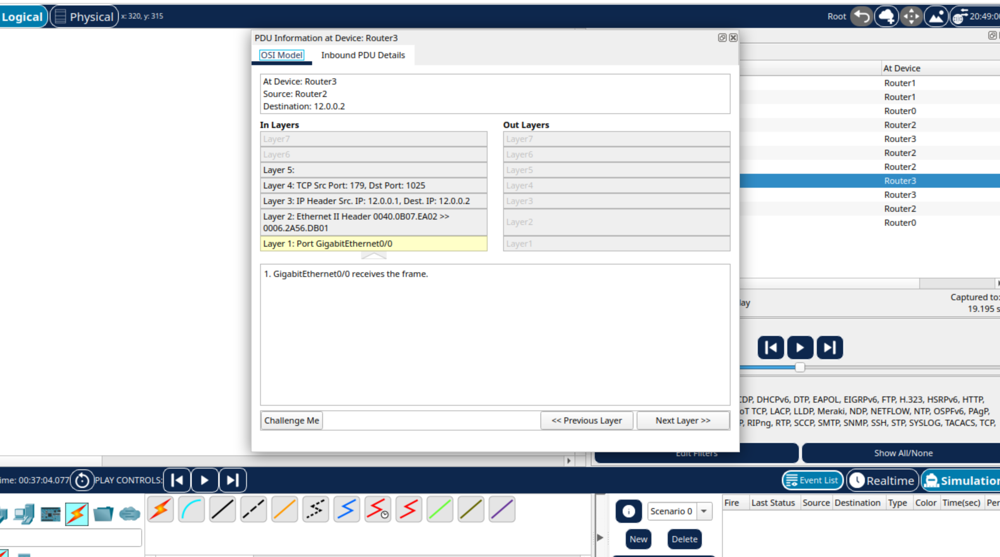

دلایل استفاده از TCP:

قابلیت اطمینان (Reliability):
BGP نیاز دارد که تمام به‌روزرسانی‌ها بدون از دست رفتن بسته و به ترتیب صحیح برسند.
TCP با مکانیزم‌هایی مثل ACK، sequence number و retransmission این قابلیت را فراهم می‌کند. UDP چنین قابلیتی ندارد.

حفظ نشست (Session):
BGP یک اتصال پایدار (long-lived session) بین دو روتر دارد. TCP به‌صورت ذاتی با connection-oriented بودن و کنترل جریان (flow control) این نشست را مدیریت می‌کند.

حجم پایین ولی اهمیت بالا:
برخلاف پروتکل‌هایی مثل OSPF که flood زیادی از پیام‌ها دارند، BGP پیام‌های کم‌تعداد ولی حیاتی می‌فرستد. TCP در این شرایط بهینه‌تر است چون به جای طراحی مکانیزم اطمینان از صفر، BGP از قابلیت‌های آماده TCP استفاده می‌کند.

استفاده از پورت شناخته‌شده:
BGP روی پورت TCP شماره 179 کار می‌کند، که به معنی ارتباط پایدار و استاندارد بین پیاده‌سازی‌های مختلف است

| ویژگی                  | **iBGP** (Internal BGP)                                                                   | **eBGP** (External BGP)                                                |
| ---------------------- | ----------------------------------------------------------------------------------------- | ---------------------------------------------------------------------- |
| **محل استفاده**        | بین روترهای داخل یک سیستم مستقل (AS)                                                      | بین روترهای متعلق به AS‌های مختلف                                      |
| **AS Number**          | هر دو طرف یکسان هستند                                                                     | هر طرف AS متفاوت دارد                                                  |
| **TTL پیش‌فرض در TCP** | 255 (برای جلوگیری از حملات و استفاده از multi-hop)                                        | 1 (فقط همسایه مستقیم)                                                  |
| **نیاز به full mesh**  | بله، مگر از Route Reflector یا Confederation استفاده شود                                  | خیر، فقط بین روترهای مرزی ارتباط هست                                   |
| **هدف اصلی**           | انتقال اطلاعات مسیر از یک نقطه AS به نقاط دیگر AS بدون تغییر در تصمیم‌گیری‌های بین‌المللی | تبادل مسیر بین سازمان‌ها/ISP‌ها برای رسیدن به اینترنت یا شبکه‌های دیگر |
| **تغییرات در مسیر**    | معمولاً **Next-hop** تغییر نمی‌کند                                                        | معمولاً **Next-hop** به آدرس روتر فرستنده تغییر می‌کند                 |
| **اعمال policy**       | بیشتر برای کنترل داخلی مسیرها                                                             | بیشتر برای سیاست‌های بین AS (مثلاً فیلتر کردن Prefixها)                |

بنابراین
BGP از TCP استفاده می‌کند چون به یک ارتباط پایدار، مطمئن و مرتب نیاز دارد، و TCP همه این‌ها را آماده در اختیار می‌گذارد.
iBGP داخل یک AS است و نیاز به full mesh یا route reflector دارد.
eBGP بین دو AS متفاوت است و بیشتر برای ارتباطات بین‌AS استفاده می‌شود.

